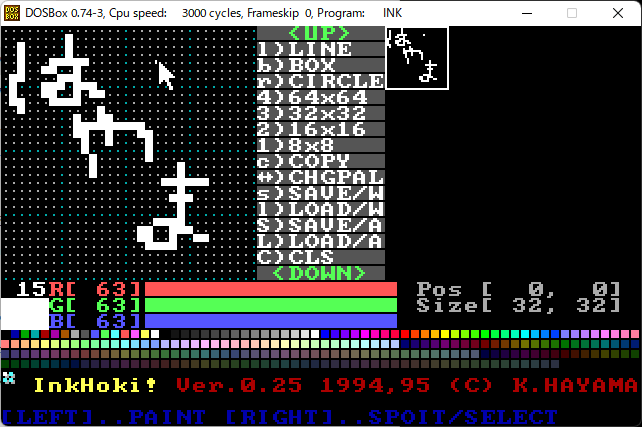
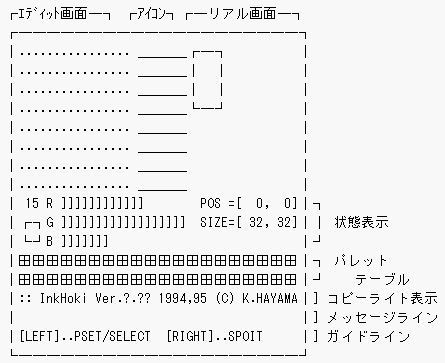

VGA用パターンエディタ 「いんくほーき」
======================================



- このソフトウェアは 1993~1995年頃に DOS/V 環境向けに作成したパターンエディタです。
- 以下は添付の inkhoki.doc (テキストファイル)の内容を markdown 化して、レイアウトを調整したものです。

----------

画面モード13h (320x200x256色) でのゲーム用のパターンの製作に主眼をおいたパターンエディタです。特徴としては、

- 背景との重ね合せを考慮して透明色を257番目の色として用意。さらにプログラム中の重ね合わせが実現しやすいデータ形式を提供。(サンプル表示ルーチン付き)
- ８×８から64×64までの大きさのパターンをエディット可能。 合計サイズとして、128×128まで一度にエディット可能。
- ファイル名の入力以外の操作は、だいたいマウスだけで可能。でも、 ショートカットキーもできるだけ用意している。
- 256色以下ならWindows'BMPファイルも一応読み書きできる。

があげられます。一方、漢字ファイル名が扱えません。

■ 立ち上げ方 ■
--------------

mouse.com(あるいは互換ドライバ)を常駐させ、

```
C:\> ink[Enter]
```

と入力すると、モニターが「ぷちっ」と鳴って、以下のような画面が現れます。 引数にファイル名を指定すると、 そのファイルをサイズが128×128ドットのパターン、あるいはパレットとみなしてロードします。ファイルの種類は拡張子で判別します。

- .PAL ... パレットファイル
- .SPR ... パターンファイル(SKIPDOT形式)
- .PE  ... パターンファイル(BETA形式)
- .BMP ... Windows'BMPファイル

パターンのフォーマットの詳細は、SAVE/LOADの節で解説します。また、カレントディレクトリの `"_ink"` というファイルに記述しておくこともできます。

■ 画面の説明 ■
--------------



「リアル画面」とは、エディットするパターンが原寸大で表示される領域です。 この内の白い四角形で囲まれた範囲を拡大した領域が 「エディット画面」です。パターンは、このエディット画面を通じて修正します。

エディット画面とリアル画面に挟まれた文字列がアイコンです。

■ マウス操作 ■
--------------

### \<エディット画面\>

- 左ボタン ... 色を置く
- 右ボタン ... クリックで色を拾う(スポイト)。押しながら動かすと領域指定。

右ボタンで指定した枠を右ボタンでドラッグし、ここぞというところで左ボタンを押すと領域コピーができる。

### \<カラーバー\>

左右にドラッグすると、現在のペンカラーのRGB輝度が増減されます。

### \<パレットテーブル\>

- 左ボタン ... 色を拾う。領域指定されているときは、枠内をその色で埋める。
- 右ボタン ... 色を拾う。

透明色は、パレットテーブルの左下の 「::」のようなアイコンで代用。

### \ <リアル画面\>

- 左/右ボタン ... エディット画面の位置を移動(８ドット単位)

■ アイコンの説明 ■
------------------

### \<UP\> と \<DOWN\>

アイコンテーブルに収まらない部分のアイコンを画面に表示します。\<UP\>でロールダウン、\<DOWN\>でロールアップします。

### QUIT ( ショートカットキー:'q' )

パターンエディタを終了します。全画面のセーブの有無と、 終了の確認をしてきます。マウスの左ボタン、キーボードの'ｙ'で \<Yes\>、同様に右ボタン、'ｎ'で  \<No\> と入力できます。ファイル名の入力については、ファイルセレクタの項で説明します。このアイコンは最初に表示されていないので、\<DOWN\>アイコンで出現させなければ、いけません。

### 8x8('1') , 16x16('2') , 32x32('3') , 64x64('4')

エディット画面の大きさを変えます。

### COPY ('c')

エディット画面のサイズ単位で、複写を行います。 現在のエディット範囲が転送元になり、 転送先はマウスで新たにリアル画面上をクリックします。なお、転送元の透明色のドットは転送されず、転送先のドットが保存されます。リアル画面以外をクリックするとキャンセルされます。

### CLS ('C' )

現在のエディット画面の領域を透明色で塗りつぶします。

### LINE ('-':マイナス)

n 個(n≧2)の点を次々に結びます。右ボタンで終了します。

### BOX ( 'b' )

対角の2点をクリックしてください。

### CIRCLE ( 'r' )

塗りつぶした楕円を描きます。長方形の対角の2点をクリックすると、その長方形に収まる最大の楕円を描きます。

### CHGPAL ( TAB )

0～15までのパレットをデフォルトに戻します。もう一度、実行すると変更したものに戻します(トグル動作)。 マウスカーソルやアイコンなどがパレットの変更で見えなくなった時のための機能です。
### SAVE('s') , LOAD('l') , SAVE/ALL('S') , LOAD/ALL('L')

パターン(パレット)をセーブ/ロードします。 SAVE/ALL,LOAD/ALLはリアル画面全体が対象で、SAVE,LOADはエディット画面内が対象です。

アイコンをクリックすると出力形式一覧があらわれるので、 いずれかを選択し、次にファイル名を入力してください。

形式には以下のようなものがあります。

#### "SkipDot" (スキップドット法)

最もコンパクトです。また、 リアルモードではパターンを最も高速にVRAMに展開できます。(ということはプロテクトモードではこれをこえるアルゴリズム&データ構造があるということですね)

"SkipDot"ファイル形式

| サイズ/bytes | 内容
|--------------|--------
| 2            | 次の非透明ドットまでの VRAM スキップバイト数Δx+Δy×320
| 2            | そのドットから連続する非透明ドットのドット数(=:n)
| n            | ドットパターン
| 2            | スキップバイト数
| :            |              :
| n'           | ドットパターン
| 2            | == 0 (終了マーク)
| 2            | == 0 (終了マーク)

この形式でセーブしたパターンを画面に表示する時のサンプルルーチンを以下に示します。

例)

```
/* djgpp ならば、farを消し、0xA0000000を0xD0000000にする
 * 画面モード13hを想定
 */
void draw(int x,int y,char *pattern)
{
    char far *vramptr; = (char far *)0xA0000000 + x + y*320;
    union{
        unsigned short far *word;
        unsigned char  far *byte;
    } srcptr;

    srcptr.byte = pattern;
    vramptr     = (char far *)0xA0000000 + x + y*320;

    for(;;){
        int i;

        /* 最初のワードはスキップ量 */
        vramptr += *srcptr.word++;

        /* 次のワードはコピーのバイト数
           ==0 なら、終了する       */
        if( (i=*srcptr.word++) == 0 )
            break;

        while(i--)
            *vramptr++ = *srcptr.byte++;
    }
}

; アセンブリ言語バージョン
;   es = A000h  di = 320*y0+x0
;   ds:si = pattern address
cpylop: lodsw
        add     di,ax
        lodsw
        mov     cx,ax
        jcxz    exit
        rep movsb
        jmp     cpylop
exit:
```

#### "BETA"

「ベタ」セーブです。末尾に透明フラグのプレーンがつきます。 寸法は記録されませんが、 ロード時にファイルサイズから計算します (ドット数の平方根を取っているだけですが)。

"BETA" ファイル形式

| サイズ/bytes | 内容
|--------------|-------
| (w\*h)       |カラーコード(1byte=1dot)
| (w\*h+7)/8   |マスクパターン(1bit=1dot 1:透明 0:非透明) <br> 左端のドットがMSB(128の位)

#### "Plane16" (16色プレーン)

16色モードの時に使うパターンを出力します。カラーコードが17～255のドットについては下位4bitのみ参照されます。 これはサイズが記録されないので注意してください。

ファイル形式

| サイズ/bytes | 内容
|--------------|------
| (w\*h+7)/8   | 青色プレーン(左端のドットが128の位)
| (w\*h+7)/8   | 赤色プレーン
| (w\*h+7)/8   | 緑色プレーン
| (w\*h+7)/8   | 輝度プレーン
| (w\*h+7)/8   | マスクパターン(1bit=1dot 0:非透明 1:透明)

#### "DIB/BMP" (Windows/OS2 Bitmap)

Windows/OS2用BMPファイルです。黒(カラーコード0)を透明色扱いします。圧縮には対応していません。LOADの場合、2/16/256色のみの対応で、最高128×128ドットまでしか読みこめません(はみ出した分は無視します)。2色の時は、透明色と白(カラーコード15)として読みます。

#### "Palette"

パターンではなく、現在のパレットをセーブ/ロードします。SAVE/ALL,LOAD/ALLでも動作は同じです。

ファイル形式

| サイズ/byte | 内容
|-------------|------
| 1           | パレット 0 の青(0～63)
| 1           | パレット 0 の赤(0～63)
| 1           | パレット 0 の緑(0～63)
| 1           | パレット 1 の青(0～63)
| :           |                 :
| 1           | パレット255の緑(0～63)

### ■ ファイルセレクタ ■

ファイルを扱うコマンドを選択すると、まずキーボードからの入力モードとなります。この時、以下のようなキーが使えます。Emacs準拠。

|     |
|-----|----
| Enter           ^M |    入力終結
| Esc             ^G |    キャンセル
|                 ^F |  カーソルを次の文字へ移動
|                 ^B |    カーソルを前の文字へ移動
|                 ^A |    カーソルを先頭へ移動
|                 ^E |    カーソルを末尾へ移動
|                 ^D |    カーソル位置の文字を削除
|       BackSpace ^H |    カーソルの前の文字を削除

キーボード入力の際に、何も入力しないで Enter/^M を入力すると、マウスによるファイルセレクタが立ち上がります。

- 白い文字     ... そのファイルを選択
- 黄色い文字   ... そのディレクトリに移動
- \<\< MORE \>\>   ... 画面に表示しきれないファイルを表示
- \<\< LESS \>\>   ... [MORE]を選択する前に表示していたファイルを表示
- \[C\] \[D\] など ... 交換不可能なディスクドライブに移動
- \<A\> \<B\> など ... 交換可能なディスクドライブに移動
- その他の領域 ... キャンセル

■ 配布条件など ■
-----------------

「いんくほーき」はフリーソフトウェアです。
転載・配布は自由ですが、著作権は作者:葉山 薫にあります。

なお、本プログラムで万が一、何らかの損失が生じたら、
作者としては気の毒だなぁとは思いますが、一切責任を負いません。

■ 履歴 ■
--------

### 0.0x (Borland C++ Version)  '93 夏ごろ

京都大学11月祭展示用ゲーム「ばん！ばすたぁ」\[(C) ばんぐほーきProject\]
製作用に京大マイコンクラブ第二部室にて開発。
名前は、単にPattern Editorの略から PE とした。

### 0.1x (djgpp Version)  '93 冬から'94春ごろ

互換機を買ったのはいいが、Borland C++まで買えなかったので、djgppにコンパイラを変更。386以上のCPUでしか動かなくしてしまった。ファイルセレクタ他、余計な機能をどんどん付けていった。

### 0.2x (LSI C-86 Version)

go32.exeがいつもついてまわるのが嫌だったので、C++で組んでいたものをCに書替えて、コンパイラを今度はLSI C-86試食版に変更した。元々、クラスなどの機能はあまり使っていなかったので、一日で出来てしまった。再び、286以下のCPUでも動くようになってしまった。(^\_\^;)

### 0.20 (94/7/18)

- 「Circle」を追加。

### 0.21 (94/7/21)

- 「ばんぐぺんき」と名付け、ロゴを作る。

### 0.22 (95/5/10)

- 名前を「いんくほーき」と変え、アイコンレスのショートカットを加える  
    (例:カーソルキーでマウス移動など)。ファイル名も"inkhoki.exe"に変え
    る。

### 0.23 (95/7/19)

- 右ドラッグでの範囲指定機能 & パレットクリックによる塗り潰し機能
- 透明色アイコン(::)をパレットの下につける。
- ファイル名が長いので 「ink.exe」 とした。 ドキュメントファイル名も「PE.DOC」→「INKHOKI.DOC」とした。
- OUTPUT/N を新設 , WRITE を OUTPUT/S と改名

### 0.24 (95/7/27)

- OUTPUT/N(32bitmsk),OUTPUT/S(SkipDot)をSAVE/LOADのSubMenu下に置く。
- 他に、Windows'Bitmap(DIB/BMP)なども加える(SAVEのみ)。

### 0.25 (95/8～9)

- Windows'Bitmapを LOAD できるようにした。
- "32bitmsk"廃止
- ドキュメントファイル名「INKHOKI.DOC」→「INKHOKI.TXT」
- パレット機能。完璧のサポート。
- コマンドラインやファイル(".\_INK")でロードするファイルを指定できるようになった。
- IBM-DOS/V Extensionの縦長テキストモード(both 03h,70h)  から呼び出されても、終了時、ちゃんと縦長テキストモードへ復帰するようにした。
- -- Bugfixing List --
    1. LOAD(BETA)    透明色が黒ドットに化けてしまう。
    2. SAVE(SKIPDOT) 範囲指定時に範囲が狂う。
    3. SAVE(BITMAP)  幅が32dotの倍数でない場合、ドットがずれる。

### 0.25b (95/11/10)

- 実行ファイルは変化なし。 ヘッダファイルの変更によるコンパイルエラーを除去したもの。

### 0.25c (95/11/16)

- パレット機能のバグフィックス。どこが完璧のサポートじゃ。 肝心のロード・セーブができんかったじゃないか！すまん、すずき。

参考文献
--------

- [「DOS/Vプログラミングガイド」 最上　晃 著](https://www.amazon.co.jp/dp/4756104460)
- [LSI C-86 Ver.3.30c 試食版](http://www.lsi-j.co.jp/freesoft/)(ﾕｰｻﾞｰｽﾞﾏﾆｭｱﾙ "LSIC86.MAN" ｴﾙ･ｴｽ･ｱｲ ｼﾞｬﾊﾟﾝ(株)
- [「DOS/Vプログラマーズハンドブック」C.F.Computing 著](https://www.amazon.co.jp/dp/4890524290)
- I/O別冊「Computer fan」1994 2号 "BMPビューア" 田嶋 孝行 著
